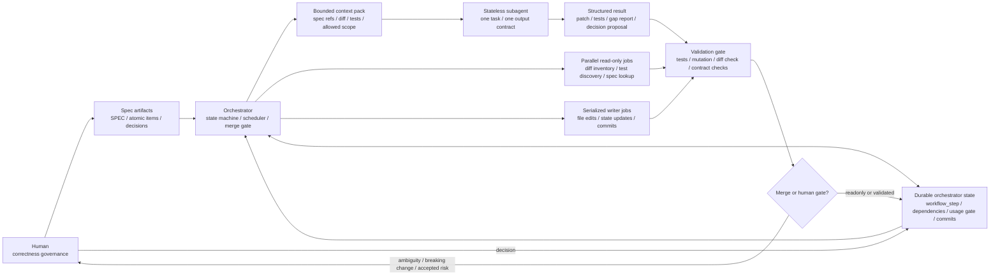

# Spec-Driven Change Verification Workflow Playbook

## 目的

本文件整理一套以 **Spec / Plan 為起點、以 Change / Diff 為觸發、以 Mutation Testing 驗證測試有效性、並透過 Human-in-the-Loop 控制規格演進** 的完整工作流。

它不是單純的測試流程，而是一套結合：

- Preflight Protocol
- Spec Drill-down / Clarification Loop
- Devil's Advocate Review
- Specification-Driven Development, SDD
- Test-Driven Development, TDD
- Change / Diff Analysis
- Meta JIT Tests
- Mutation Testing
- Human-in-the-Decision-Loop Governance
- Spec / Test Evolution

的 **AI-assisted verification workflow**。

核心目標是：

> 不只是讓測試存在，而是讓測試能證明自己有效；不只是讓程式符合測試，而是讓程式、測試與規格一起演進。

同時，本 workflow 的長期執行架構不應依賴單一長對話累積全部 reasoning context。單體長對話會讓每個後續步驟都背負前面所有討論、diff、測試與 review 結果，實務上容易出現近似 `O(N^2)` 的 token 成本、context 污染與 resume 失真。

目標執行架構是 **Grid of Atomic Subagents**：

```text
durable orchestrator state
  -> bounded context pack
  -> short-lived stateless subagent
  -> structured result / artifact
  -> orchestrator state update
```

也就是把長流程拆成可獨立啟動、可並行、可驗證、可丟棄上下文的短生命週期工作單元，讓 token 成本趨近於 `O(N)`，並把 correctness、progress、decision 與 traceability 留在 durable artifacts，而不是留在聊天記憶裡。

---

## 構思來源與演化脈絡

### 1. 從 SDD / TDD 開始

最初的構想來自：

```text
spec -> test case -> implement
```

也就是先定義系統應該如何正確運作，再根據 spec 產生 test case，最後才進入 implementation。

這裡的關鍵不是單純追求 coverage，而是：

- 自製 test case 必須能 trace 回 spec
- test case 要驗證規則、邊界、例外與 invariant
- 不應該為了 coverage 而寫沒有語意來源的 test

因此，本 workflow 的第一原則是：

> Spec defines correctness.

---

### 2. 加入 Mutation Testing：驗證測試是否有效

傳統 coverage 只能說明「程式碼有被跑到」，不能證明「如果程式壞掉，測試抓得到」。

Mutation Testing 的角色是刻意破壞程式：

```text
M(code) -> code'
```

然後重新執行測試：

```text
mutation killed   -> test is effective
mutation survived -> validation gap exists
```

因此，本 workflow 將測試品質從：

```text
有沒有測到？
```

提升成：

```text
測試是否真的能抓到錯？
```

---

### 3. 受到 Meta JIT Tests 啟發：根據 Diff 動態產生測試

Meta JIT Tests 的啟發在於：

> 測試不一定只能是事先寫好的靜態集合，也可以根據 PR / commit diff 即時產生。

因此 workflow 加入：

- diff analysis
- impact analysis
- intent-aware analysis
- JIT test generation

讓每次變更都觸發針對性的驗證。

基本想法是：

```text
PR / commit diff
  -> infer intent
  -> identify impacted components
  -> generate / select focused tests
  -> run tests
```

這讓測試成本不必每次都全量爆炸，也能更聚焦在本次變更真正可能影響的區域。

---

### 4. 比 Meta JIT Tests 多一步：用測試結果反推是否需要更新 Spec

本 workflow 不只是在 diff 後產生 JIT tests。

更重要的是：

> 當 JIT test 或 mutation result 發現 gap 時，要回頭檢查 spec 是否不足、過時或需要演進。

也就是從：

```text
change -> test -> pass/fail
```

進一步變成：

```text
change -> test -> mutation -> gap analysis -> spec/test evolution
```

可能的判斷包括：

- test 不足，需要補測試
- spec 不清楚，需要補規格
- code 改變了行為，需要判斷是否接受
- change 與現有 spec 衝突，需要 reject 或重寫 spec

這使整套流程變成 self-evolving verification system。

---

### 5. 加入 Human-in-the-Loop：人負責治理，不負責手動驗證

Human-in-the-Loop 的定位不是要人手動跑測試或逐條驗證結果。

人的角色是：

- 定義 correctness
- 解決 ambiguity
- 決定 spec 是否要演進
- 在 accept / update spec / reject change 之間做決策

換句話說：

> Humans do not validate the system — they govern it.

---

### 6. 受到個人 AI 助理 initial 流程啟發：加入 Spec Drill-down

在 plan / spec 還沒有明確之前，不應該急著進入實作。

受到個人 AI 助理 initial flow、以及多輪澄清式 agent / skill 設計啟發，本 workflow 在前段加入：

```text
Spec Drill-down / Clarification Loop
```

它的任務是透過多輪問題，把模糊需求逐步變成可實作、可驗證、可測試的 spec。

它要補齊：

- input / output
- business rules
- constraints
- invariants
- error conditions
- edge cases
- non-goals
- acceptance criteria

---

### 7. 受到 Devil's Advocate 概念啟發：加入反方審查

Devil's Advocate 原本可理解為在決策或方案討論中，刻意由一個角色從反方、風險、刁鑽角度檢視方案。

在本 workflow 中，Devil's Advocate Review 放在 plan / spec 定稿之前，任務不是補充需求，而是挑戰方案：

- 有沒有隱含假設？
- 有沒有過度設計？
- 有沒有漏掉 edge cases？
- 有沒有違反既有架構原則？
- 有沒有更簡單的做法？
- 有沒有維護成本、測試成本、遷移風險？
- 有沒有 spec 與 implementation 可能脫鉤的地方？

這讓 workflow 在進入 implementation 前先經過一次風險導向的反方檢查。

Devil's Advocate Review 的結果必須列成帶有 spec scope 的編號清單，格式為
`DA-[Phase-X/CR-X]-[流水號]`，例如 `DA-P0-001`、`DA-CR-001-001`，並標示
`Low`、`Medium`、`High`。這些項目不是一般建議，而是進入 atomic decomposition
前的 drill-down queue：必須從低到高逐條釐清、處置並更新 spec；若仍有 open /
unresolved 項目，不得進入 atomic item 拆分。

### 8. 從 Monolithic Chat 到 Grid of Atomic Subagents

本 workflow 早期可由同一個互動式 agent 一路完成，但當任務包含 Devil's Advocate Review、Meta JIT Test、Mutation Test 評估與多個 atomic items 時，單一長對話會快速膨脹：

- 每個新步驟都重新攜帶前面全部 reasoning 與 artifacts，token 成本趨近 `O(N^2)`。
- 舊的假設、失效的 draft、已處置的 objection 容易污染後續判斷。
- resume 時很難分辨 durable state、聊天摘要與 agent 自行腦補的狀態。
- 無法安全平行化 read-only analysis、test selection、mutation interpretation 等可切分工作。

因此，正式自動化目標是讓 playbook 由 `orchestrator` 編排，而不是由長對話本身承載流程狀態。

```text
orchestrator = state machine + durable store + scheduler + merge gate
subagent     = one bounded context pack + one task + one structured output
```

Orchestrator 保留 workflow state、atomic item metadata、dependency graph、usage gate、commit checkpoint 與 human decision status。Subagent 預設無狀態、短生命週期、不可繼承上一個 subagent 的聊天脈絡；它只能根據 context pack、allowed scope 與 output contract 執行單一 step 或單一 atomic item。

---

## 核心原則

### 1. Spec defines correctness

Spec 是 correctness 的來源。

Code、test、JIT test、mutation evaluation 都必須回到 spec 判斷。

---

### 2. Test cases must trace back to spec

禁止沒有語意來源的測試。

每個 test case 應該能回答：

```text
這個 test 對應哪一條 spec？
它驗證的是 rule、boundary、invariant、error condition，還是 regression scenario？
```

---

### 3. Changes trigger verification

PR / commit diff 是驗證觸發點。

每次變更都應該觸發：

- impact analysis
- intent analysis
- risk identification
- focused test selection / generation

---

### 4. Tests must be validated, not trusted

Generated tests 不能一產生就被視為可信。

它們需要經過：

- baseline execution
- mutation validation
- stability observation

才可能成為長期資產。

---

### 5. Mutation testing validates test effectiveness

Mutation score 比單純 coverage 更接近測試有效性。

Coverage 告訴你 code 有被跑到。

Mutation testing 告訴你：

```text
如果 code 被破壞，test 是否會失敗？
```

---

### 6. Humans govern correctness

人不應該卡在低階驗證工作。

人應該負責：

- 決定 spec
- 決定 ambiguous behavior
- 決定 breaking change 是否接受
- 決定是否更新 spec

---

### 7. Durable state belongs to the orchestrator

長流程狀態不應依賴某一段聊天上下文。

以下資訊必須寫入 durable location，例如 spec metadata、atomic item index、run note、orchestrator state 或 commit history：

- selected workflow / atomic item ID
- `implementation_status`
- `workflow_step`
- dependency edges
- test / mutation / JIT artifacts
- remaining gaps
- human decision status
- completion report

---

### 8. Subagents are stateless and bounded

每個 subagent 應被視為短生命週期 worker：

- 只接收完成當前 task 所需的最小 context pack。
- 只修改或分析 allowed scope。
- 只產出 structured result、patch、test result、gap report 或 decision proposal。
- 完成後不得把自己的聊天上下文當成下一步的隱性輸入。

若下一步需要使用上一個 subagent 的發現，必須先由 orchestrator 將其整理成 durable artifact 或 compact handoff，再交給下一個 subagent。

---

### 9. Context budget is an architecture constraint

省 context 不是便利性最佳化，而是 workflow correctness 條件。

若工作單元無法用 bounded context pack 執行，通常代表：

- atomic item 太大
- spec refs 不足
- output contract 不清楚
- dependency graph 沒有拆開
- 應先回到 Step 1 / Step 2 / Step 4.5 重新整理

---

## 架構圖與決策流程圖

### Grid of Atomic Subagents 架構圖



### 決策流程圖

以下 Mermaid 對應 `diagrams/spec-driven-change-verification-workflow-playbook/sdvc-workflow-decision-flow.png` 的主決策流，採用 styled decision-flow layout。側欄支援系統保留為關鍵 support nodes；正式執行細節仍以後續完整工作流與 orchestrator state 規則為準。

```mermaid
%%{init: {
  'theme': 'base',
  'themeVariables': {
    'background': '#0b0f19',
    'primaryColor': '#1e293b',
    'primaryTextColor': '#f8fafc',
    'lineColor': '#475569',
    'textColor': '#f8fafc',
    'edgeLabelBackground': '#0b0f19'
  }
}}%%

flowchart TD
  classDef blueBox fill:#1e3a8a,stroke:#3b82f6,stroke-width:2px,color:#f8fafc;
  classDef grayBox fill:#334155,stroke:#64748b,stroke-width:2px,color:#f8fafc;
  classDef greenBox fill:#064e3b,stroke:#10b981,stroke-width:2px,color:#f8fafc;
  classDef redBox fill:#7f1d1d,stroke:#ef4444,stroke-width:2px,color:#f8fafc;
  classDef purpleBox fill:#4c1d95,stroke:#8b5cf6,stroke-width:2px,color:#f8fafc;
  classDef darkBox fill:#111827,stroke:#374151,stroke-width:1px,color:#9ca3af;

  Start([START]) --> Step1["1. INTENT RECEIVED<br/>Goal / Problem / Requirement"]
  Step1 --> Step2["2. PROPOSAL CREATION<br/>propose/change-id/proposal.md<br/>Scope / Intent / Constraints / Risks / Impact"]

  Step2 --> Gate3{"3. PROPOSAL DECISION GATE<br/>Is the proposal clear, feasible and aligned?"}

  Gate3 -- NO --> Reject3["REJECTED<br/>Feedback / Clarify<br/>Re-scope / New Proposal"]
  Gate3 -- YES --> Step4["4. DELTA SPEC DEFINITION<br/>ADDED / MODIFIED / REMOVED requirements<br/>BDD scenarios / acceptance criteria"]

  DA["DA Design Alignment<br/>Cross-model discussion<br/>Intent alignment / risk review"]
  Gate3 -. design alignment .-> DA
  DA -. review result .-> Gate3

  Step4 --> Gate5{"5. SPEC REVIEW GATE<br/>Are specs complete, consistent and verifiable?"}
  Gate5 -- NO --> Rework5["SPEC REWORK<br/>Clarify requirements<br/>Refine scenarios / update spec"]
  Rework5 --> Step4
  Gate5 -- YES --> Step6["6. TASK BREAKDOWN<br/>Atomic tasks / verification units<br/>Dependency split / TDD plan"]

  Step6 --> Gate7{"7. TASK VALIDATION GATE<br/>Are tasks atomic, independent and testable?"}
  Gate7 -- NO --> Revise7["REVISE TASKS<br/>Re-split / adjust dependencies<br/>Update plan"]
  Revise7 --> Step6
  Gate7 -- YES --> Step8["8. EXECUTION ROUTING<br/>Router selects best model and skills based on task type, cost, quality, context, and policy"]

  subgraph Execution_Routing["Execution targets"]
    direction LR
    O1["OpenAI<br/>Codex"] --- A2["Anthropic<br/>Claude"] --- G3["Google<br/>Gemini"] --- L4["Local<br/>Models"] --- C5["Custom<br/>Adapters"]
  end
  Step8 --> Execution_Routing

  Execution_Routing --> Step9["9. IMPLEMENTATION<br/>Code / config / tests<br/>Docs / infra / refactor / enhance"]

  RuntimeEnforce["RUNTIME HOOKS ENFORCED<br/>Pre / post hooks<br/>Quality gates / guardrails"]
  Step9 -. hook enforcement .-> RuntimeEnforce

  Step9 --> Gate10{"10. VERIFICATION AND REVIEW GATE<br/>All verification passed?"}

  Gate10 -- YES --> Step11["11. CHANGE ACCEPTED<br/>Change is verified, approved and ready"]
  Gate10 -- NO --> Step12["FAILURE HANDLING LOOP<br/>Analyze failure<br/>Fix / adjust / retry<br/>Re-verify"]

  Step12 --> Step9
  Step11 --> Step13["12. CRYSTALLIZATION<br/>Extract knowledge / update playbooks<br/>Update skills / refine runtime laws"]
  Step13 --> Step14["13. ARCHIVE AND INGESTION<br/>Delta merge and versioning<br/>Ingest to RAG / knowledge base"]
  Step14 --> Continuous([14. CONTINUOUS EVOLUTION])

  class Start,Step1,Step2,Step4,Step6,Step8,Step9,Step13,Step14,Continuous blueBox;
  class Gate3,Gate5,Gate7,Gate10 grayBox;
  class Reject3,Rework5,Revise7,Step12 redBox;
  class Step11 greenBox;
  class DA,RuntimeEnforce purpleBox;
  class O1,A2,G3,L4,C5 darkBox;
```



#### 決策流程圖支援看板

右側長條看板不直接塞進 Mermaid 主圖，以免 renderer 自動排線造成交錯。這些內容作為支援系統與外部整合清單，搭配上方決策流閱讀。

| Playbook / Skill / Hook Stack | Included Capabilities | Workflow Role |
| --- | --- | --- |
| Playbooks | Workflow playbooks; verification playbooks; TDD / design playbooks; recovery playbooks | 提供流程、驗證、設計與復原策略的可追溯操作準則。 |
| Skills Library | Spec authoring; task decomposition; test generation; code review; refactoring | 將決策流程中的 spec、task、test、review 與 cleanup 工作拆成可委派能力。 |
| Runtime Hooks | Pre / post hooks; quality gates; policy guardrails; output validation; trace and audit | 在 implementation 與 verification 期間執行自動檢查、阻擋違規輸出，並留下稽核線索。 |
| Runtime Laws | Safety first; spec first; verify always; small and atomic; iterate and improve | 作為跨 playbook、skill、hook 的不變治理原則，防止 agent 單方面改寫 correctness。 |

| External Integrations | Examples | Workflow Role |
| --- | --- | --- |
| Git / GitHub | Commit history; branches; pull requests; reviews | 提供 diff source、review boundary、checkpoint 與版本追溯。 |
| CI / CD | Jenkins; GitHub Actions | 執行 automated validation、policy checks、release 或部署前 gate。 |
| Test Frameworks | PyTest; Playwright | 承載 baseline tests、focused tests、browser / integration tests 與 regression suites。 |
| Monitoring | Prometheus; Grafana | 將 production signal、alerts、performance drift 或 behavior anomaly 轉成 input sources。 |
| Artifacts / Storage | S3; GCS; MinIO | 保存測試輸出、mutation reports、run artifacts、logs 與可重現 evidence。 |
| Notifications | Slack; Email | 回報 gate failure、human decision request、handoff、review needed 與 workflow completion。 |

---

## 完整工作流

```text
0. Preflight Protocol
   ↓
1. Spec Drill-down / Clarification Loop
   ↓
2. Draft Plan / Draft Spec
   ↓
3. Devil's Advocate Review
   ↓
3.5 Numbered Devil's Advocate Drill-down Gate
   ↓
4. Revised Spec
   ↓
4.5 Workflow Decomposition / Atomic Work Items
   ↓
5. Spec-Based Test Design
   ↓
6. Implementation
   ↓
7. Change Detection / Diff Analysis
   ↓
8. Intent & Impact Analysis
   ↓
9. Risk & Gap Identification
   ↓
10. Meta JIT Test Generation
   ↓
11. Test Execution
   ↓
12. Mutation Testing
   ↓
13. Test Effectiveness Evaluation
   ↓
14. Decision Proposal
   ↓
15. Human Decision
   ↓
16. Spec / Test Evolution
```

上面的 step sequence 是 correctness workflow；實際執行時應套用 Grid of Atomic Subagents execution overlay：

```text
Step metadata / atomic item metadata
  -> Orchestrator state machine
  -> build bounded context pack
  -> launch stateless subagent for one step or one atomic item
  -> validate structured output and artifacts
  -> merge result into durable state
  -> advance workflow_step or mark blocked
```

可平行的步驟應由 orchestrator 依 dependency graph 派發，例如 read-only diff inventory、test discovery、spec reference lookup、候選 JIT test review、mutation result classification。會修改檔案、推進 `workflow_step`、建立 commit 或改變 correctness decision 的步驟必須經過 merge gate，避免多個 subagents 同時寫同一個 durable state。

---

## 工作流詳細說明

### Step 0 — Preflight Protocol

在開始複雜任務前，先列出：

- 任務理解
- 假設
- 不確定處
- 兩種以上可能解讀
- 風險
- 下一步

目的：

- 避免 agent 直接跳到實作
- 讓隱含假設先浮出來
- 決定是否需要進入 drill-down

---

### Step 1 — Spec Drill-down / Clarification Loop

針對不明確的 plan / requirement 進行多輪追問。

輸入：

- 初始需求
- preflight 結果
- 已知 constraints

輸出：

- clarified requirements
- open questions
- acceptance criteria
- non-goals
- testable spec candidates

範例問題：

```text
這個功能的主要 input / output 是什麼？
哪些行為是一定不能改變的？
哪些 edge cases 必須保留？
這次變更是 bug fix、feature、refactor，還是 behavior change？
如果既有行為與新需求衝突，以哪一邊為準？
```

---

### Step 2 — Draft Plan / Draft Spec

根據 drill-down 結果產生初版 plan / spec。

Draft spec 應包含：

- context
- goal
- scope
- non-goals
- inputs
- outputs
- business rules
- invariants
- error conditions
- acceptance criteria
- testing implications

#### Spec 文件落點與 README 分工

一般原則：

> README 是入口，Spec 是 correctness contract。

README 適合放：

- 這個專案 / module 是什麼
- 為什麼存在
- 快速開始或基本使用方式
- 高階流程與架構概念
- 預期目錄結構
- roadmap / version direction
- 指向正式 spec 的連結

正式 spec 建議另外放，例如：

```text
<project>/
├─ README.md
├─ SPEC.md
└─ docs/
   ├─ v0.1.0-spec.md
   ├─ config-schema.md
   └─ export-format.md
```

建議規則：

- 小型或早期 module 可先使用 `SPEC.md` 作為目前目標版本的正式規格。
- 當同時維護多個版本、資料格式或外部 contract 時，再拆成 `docs/vX.Y.Z-spec.md`、`docs/config-schema.md`、`docs/export-format.md` 等文件。
- README 可以摘要 spec，但不應成為完整 correctness 來源。
- 若 README 與 SPEC 對行為描述衝突，規格判斷應以 SPEC 為準，並回頭修正 README 摘要。
- 當 README 開始包含 input/output contract、acceptance criteria、error conditions 或 test matrix 時，通常代表應該把這些內容提升到正式 spec。

#### 大型專案的 Spec 分層

小型或早期專案可以先以單一 `SPEC.md` 作為主要 correctness contract；但當專案變大，單檔 spec 可能造成 review 困難、merge conflict、backlog 與 accepted behavior 混雜，以及 atomic item 難以被 wrapper / orchestrator 穩定引用。

大型專案建議讓 `SPEC.md` 成為 root spec manifest / correctness index，而不是承載所有細節的單一文件。

建議結構：

```text
<project>/
├─ README.md
├─ SPEC.md
└─ specs/
   ├─ README.md
   ├─ workflows/
   │  ├─ <workflow-name>.md
   │  └─ <workflow-name>.md
   ├─ features/
   │  ├─ P0-02-<feature-or-atomic-item>.md
   │  └─ P0-03-<feature-or-atomic-item>.md
   ├─ contracts/
   │  ├─ config-schema.md
   │  └─ output-format.md
   ├─ decisions/
   │  └─ ADR-0001-<decision-name>.md
   └─ backlog.md
```

建議分工：

- `SPEC.md`：專案目標、規格狀態、current phase、selected workflow、top-level scope / non-goals、核心 invariants、spec map、accepted atomic item index、open questions summary。
- `specs/README.md`：說明 spec 資料夾結構、命名規則、狀態定義與索引維護方式。
- `specs/workflows/*.md`：主流程或資料流，例如 ingestion、analysis、export、sync、billing。
- `specs/features/*.md`：可實作 feature、phase item 或 atomic item；這類文件適合被 atomic prompt 與 wrapper 直接引用。
- `specs/contracts/*.md`：相對穩定的資料契約，例如 config schema、CLI args、API payload、output format、folder layout。
- `specs/decisions/*.md`：architecture decision record、behavior decision、dependency policy 或 scope tradeoff。
- `specs/backlog.md`：候選項目、未排程想法與 future work；backlog 預設不是 accepted correctness source，除非被提升到 active scope。

`SPEC.md` 應保留穩定連結到細項 spec，而不是複製全部內容。若細項 spec 與 `SPEC.md` 摘要衝突，應以被標記為 `Accepted` 的細項 spec 與 `SPEC.md` 的 spec map 共同判斷，並修正失同步的摘要。

Backlog 與 accepted spec 應明確分離。Backlog item 建議使用狀態：

```text
candidate / proposed / accepted / deferred / rejected
```

只有 `accepted` 且被 `SPEC.md` 或 active workflow 索引的項目，才應進入 implementation 或 atomic execution。

#### Follow-up Items / Parent Traceability

Phase、CR 或 EXP 在實作、manual run、review 或人類決策後，若產生 cleanup、runtime reliability、semantic refinement、migration debt、prompt / review calibration 等後續工作，應拆成明確 follow-up item，而不是隱性塞回 parent item 或散落在聊天紀錄。

建議 ID 格式：

```text
<phase-id>-FU-<流水號>      例如 P0-FU-01
<cr-id>-FU-<流水號>         例如 CR-001-FU-01
<exp-id>-FU-<流水號>        例如 EXP-001-FU-01
```

Follow-up item 適合用於：

- parent item 已接受或已部分完成，但後續觀察發現 default behavior、migration、prompt quality、runtime reliability 或文件索引仍有缺口。
- 後續工作必須保留 parent 語意脈絡，例如「CR 已決定取代舊行為，但部分舊入口仍是預設」。
- 該項目不應變成全新 CR / EXP，除非它改變 artifact contract、top-level lifecycle、正式 schema 或跨 phase architecture。

Follow-up item 必須保留最小 metadata：

```yaml
item_id: CR-001-FU-01
item_type: follow-up
parent_type: CR
parent_id: CR-001
status: proposed
title: Deprecate legacy Phase 0 default paths
source_path: backlog/CR-001-FU-01-deprecate-legacy-phase0-default-paths.md
parent_spec_path: specs/backlog/CR-001-appeal-point-and-art-style-extraction.md
root_spec_path: SPEC.md
integration_status: backlink-required
```

整理 follow-up 進 spec 時必須雙向 trace：

- Follow-up -> parent：follow-up metadata 或 `Parent` 區塊必須列出 parent phase / CR / EXP ID、parent spec path、產生原因，以及對應的 spec refs / acceptance criteria / risk item。
- Parent -> follow-up：parent spec 必須新增或更新 `## Follow-ups` 區塊，列出 follow-up ID、title、status、source path、reason、是否阻擋 parent completion，以及目前 integration / implementation 狀態。
- Root index -> both：若專案已有 root `SPEC.md`、spec map 或 backlog index，必須能從 root index 找到 parent 與 follow-up；不能只讓 follow-up 存在於未索引 backlog 檔。
- Tests / atomic items -> both：由 follow-up 產生的 tests、atomic items 或 prompts，`spec_refs` 應同時包含 follow-up ID 與 parent ID，例如 `CR-001-FU-01`, `CR-001`。
- Completion check：若只更新了 follow-up 檔而沒有更新 parent backlink，或只更新了 parent `Follow-ups` 區塊而找不到 follow-up source，該整理不得視為完成，必須標成 spec gap / traceability gap。

整理 follow-up 進 spec 時，應同步檢查並更新下列文件層：

| 文件層 | 必須同步的內容 |
|---|---|
| Source backlog draft | 原始 `backlog/*-FU-*.md` 應標出已整理到哪個 formal spec、parent spec、root spec，以及目前 `integration_status` / `workflow_step`。 |
| Formal follow-up spec | `specs/backlog/*-FU-*.md` 或對應細項 spec 應承載完整 scope、decisions、acceptance criteria、testing implications、atomic split draft / accepted items。 |
| Parent spec | Parent phase / CR / EXP spec 必須有 `## Follow-ups` backlink，並能說明 follow-up 是否阻擋 parent completion。 |
| Root spec / spec map | `SPEC.md` 或 root spec manifest 必須索引 parent 與 follow-up，讓 reviewer 不需要掃未索引 backlog 才能找到後續工作。 |
| Local spec index | 若存在 `specs/README.md`、`specs/backlog/README.md`、`specs/features/README.md` 等 index，必須補上 follow-up row、status、parent ID、source / formal spec path。 |
| Atomic prompts / work items | 後續 atomic item、prompt、test matrix 必須同時帶 parent ID 與 follow-up ID，避免實作完成後只 trace 到子項而失去原始 CR / EXP / phase 脈絡。 |

Sync gate：

- 若任一既有文件層適用但尚未更新，`integration_status` 不得標成 `ready`、`accepted` 或 `completed`。
- 若某文件層在專案中尚不存在，不必為單一 follow-up 強行新增；但 formal spec 或 completion report 必須註記「not present / not applicable」，避免看起來像漏同步。
- 每次 sync 後應用 `rg` / `Select-String` 或等效工具確認 parent ID 與 follow-up ID 在 root、parent、formal spec、source draft、local index 中可互相找到。

建議拆檔訊號：

- `SPEC.md` 已超過約 800-1500 行，或 review 時經常需要跳過大量不相關段落
- 同時維護多個 workflow、phase、資料格式或外部 contract
- backlog、open questions 與 accepted behavior 開始混雜
- atomic item 需要各自被 `codex exec`、wrapper 或 review 流程穩定引用
- config / output / API contract 已可獨立 review 或版本化
- 多人或多 agent 會同時修改 spec，單檔容易造成 merge conflict

#### Backlog: `DOC-REORG-01` Split Oversized Playbook into Modular Documents

Status: `proposed`

Trigger:

- `spec-driven-change-verification-workflow-playbook.md` 已累積 core workflow、spec format、atomic metadata、orchestration model、model routing、governance、anti-patterns、skills inventory 與 MVP notes。
- 文件長度已足以讓 review、resume、context pack building 與 atomic prompt reference 成本升高。
- 當剩餘 usage 低於 15%，尤其像 6% 這種 stop-point，僅應記錄此 backlog / handoff，不應啟動實質重整。

Proposed split:

- `spec-driven-change-verification-workflow-playbook.md`：保留目的、核心原則、完整 workflow 與最小執行 contract。
- `spec-driven-spec-structure-playbook.md`：搬移 spec 格式、README / SPEC 分工、大型 spec 分層、follow-up traceability。
- `spec-driven-atomic-orchestration-playbook.md`：搬移 atomic item metadata、Grid of Atomic Subagents、context pack、orchestrator / subagent contract。
- `spec-driven-verification-governance-playbook.md`：搬移 mutation / JIT / test promotion / human decision / anti-pattern governance。
- README / index：補上各拆分文件的用途、狀態與互相引用。

Acceptance criteria:

- 拆分後 root playbook 仍能作為入口，不遺失 core workflow sequence。
- 舊 anchor 或重要 section 有對應新位置，避免既有 prompts / notes 失效。
- 每個新文件都有明確 scope、non-goals 與 cross-links。
- `rg` 可從 root playbook 找到 orchestration、atomic metadata、mutation governance 與 spec structure 的新入口。
- 拆分必須在充足 usage / context 下作為獨立 atomic doc item 執行，並完成 diff check、link/readback verification 與 commit checkpoint。

#### Backlog: `PB-FU-001` Add Short Skill Execution Closeout Checklist

Status: `draft`

Source: `backlog/PB-FU-001-add-short-skill-execution-closeout-checklist.md`

Legacy ID: `SKILL-RUN-FU-01`

The former inline `SKILL-RUN-FU-01` follow-up has been consolidated into the
backlog file above. It remains non-blocking: recording or later implementing it
must not change the current spec-driven workflow, skill trigger rules,
extraction map, or child-skill contracts unless an explicit refinement item
accepts those changes.

細項 spec 若會被 atomic execution 引用，建議在文件前段保留 metadata：

```md
# P0-02 <Atomic Item Name>

Status: Accepted
Implementation Status: not-started
Workflow Step: Step 4.5 - Workflow Decomposition / Atomic Work Items
Parent Spec: ../SPEC.md
Workflow: <workflow-name>
Spec Refs: AC-03, ERR-02
Tier: Medium
Reasoning Effort: medium
Prompt File: agent-prompts/<project>/P0-02-<atomic-item>.md
```

注意：`Status` 表示 spec governance 狀態，例如 candidate、accepted 或 deferred；它不代表 item 已實作。被拆出的 atomic spec 必須另外標註 `Implementation Status` 與 `Workflow Step`，讓人類、agent、wrapper / orchestrator 都能判斷該 item 是否已實作，以及目前執行到本 playbook 的哪一個 workflow step。

#### 建議 Spec 格式

建議用以下格式產生 `SPEC.md` 或版本化 spec：

```md
# <Project / Module Name> Spec

## 規格狀態

- 目標版本：
- 規格狀態：Draft / Revised / Accepted / Deprecated
- 最後更新：

## 脈絡

說明這個功能或 module 為什麼存在、使用者是誰、它解決什麼問題。

## 目標

定義這個版本要達成的行為與主要 correctness question。

## 範圍

列出本版本必須包含的功能、資料流、整合點或可觀察行為。

## 非目標

列出本版本明確不處理的項目，避免 scope creep。

## 輸入

定義 config、CLI args、API payload、檔案格式、使用者操作或外部依賴。

## 輸出

定義檔案、資料夾、API response、事件、log、metadata 或狀態變化。

## 業務規則

列出必須成立的 domain rules、流程規則、資料轉換規則與相容性要求。

## 相容 / 替換政策

對每個 CR 或會改變既有行為的 spec，明確寫出本輪是：

- `replacement`：新行為取代舊行為，既有入口、預設輸出或使用者工作流應改成新語意。
- `backward-compatible`：新行為必須向下相容，舊入口與舊輸出仍是正式支援面。
- `compatibility-layer`：新行為是 primary，但保留顯式 legacy / migration / projection 路徑。
- `parallel-opt-in`：新行為與舊行為並行，必須由 config、CLI flag 或 feature gate 明確選擇。
- `deferred`：暫不決定相容或替換策略；不得開始會固定入口語意的實作。

若政策是 `replacement`，spec 必須列出要被替換的舊入口、舊 artifact、舊預設行為、測試期望與文件索引。
若政策不是 `replacement`，spec 必須列出 legacy 行為如何被保留、如何選擇、何時移除或為何不移除。

## Follow-ups

若此 spec / phase / CR / EXP 已產生 follow-up，使用表格保留 parent -> follow-up trace：

| ID | Status | Source | Reason | Blocks parent completion | Notes |
|---|---|---|---|---|---|
| CR-001-FU-01 | proposed | backlog/CR-001-FU-01-...md | Legacy defaults still active after CR replacement | Yes / No | Requires CR-001 native default paths |

每個 follow-up source 也必須反向列出 parent ID 與 parent spec path；若只能單向追蹤，視為 traceability gap。

## 不變條件

列出實作前後都必須保持成立的 invariant。

## 錯誤條件

列出 invalid input、外部失敗、衝突狀態、權限問題與 expected failure behavior。

## Acceptance Criteria

用 AC-01、AC-02 等條列可驗證的完成條件。

## Testing Implications

列出 test matrix，讓每個 test case trace back 到 spec reference。

## Open Questions

列出仍需 human decision 的 ambiguity、未定義行為或未來版本問題。
```

---

### Step 3 — Devil's Advocate Review

對 draft plan / spec 做反方審查。

檢查面向：

- 隱含假設
- 過度設計
- 欠缺 edge cases
- 與既有架構衝突
- 測試成本過高
- migration risk
- backwards compatibility
- CR 是否取代舊行為，或必須向下相容
- maintainability
- security / privacy / data risk
- 是否能用更簡單方法完成

輸出：

- numbered objections, sorted from `Low` to `High`
- risk list
- suggested simplifications
- required clarifications
- revision proposal

每個 objection 應包含：

```text
ID: DA-[Phase-X/CR-X]-[流水號]
Severity: Low | Medium | High
Issue:
Why it matters:
Required drill-down:
Suggested resolution:
```

CR / major behavior change 必須額外產生一個 compatibility / replacement objection
或 decision item，即使目前看似沒有相容問題也一樣。這個 item 必須回答：

```text
Does this CR replace the existing behavior, preserve it, or run in parallel?
Which old entrypoints, defaults, artifacts, configs, docs, and tests are affected?
What is the expected user-visible behavior after the CR is complete?
```

不得用「先保留舊的比較安全」或「完成 CR 後自然就是新的樣子」作為隱含假設。

---

### Step 3.5 — Numbered Devil's Advocate Drill-down Gate

針對 Step 3 產生的 numbered objections，逐條進行 drill-down。這是 spec 與
atomic decomposition 之間的 gate。

處理順序：

```text
Low -> Medium -> High
```

同一 severity 內依 objection ID 由小到大處理。

規則：

- Objection ID 必須使用 `DA-[Phase-X/CR-X]-[流水號]` 格式，讓 review item 能 trace
  back 到 phase 或 change request，例如 `DA-P0-001` 或 `DA-CR-001-001`。
- 對 CR / major behavior change，Step 3.5 必須有一條明確的 compatibility /
  replacement drill-down decision。它可以來自 Step 3 的 numbered objection，也可以在
  drill-down 時補列。若缺少此 decision，gate status 必須是 `blocked`。
- 每個 objection 都必須保留編號，直到 resolution 完成。
- 每個 objection 必須有明確狀態。候選狀態如下：

| Status | 意義 | 是否阻擋 Step 4.5 |
|---|---|---|
| `open` | 已列出但尚未 drill down 或確認 | Yes |
| `confirmed` | 已確認是真實風險或 spec gap，但尚未完成 resolution | Yes |
| `resolved-by-spec-change` | 已透過 spec 更新解決 | No |
| `resolved-by-playbook-change` | 已透過 playbook / workflow 規則更新解決 | No |
| `deferred-with-rationale` | 已明確標成 non-goal、future work 或 out-of-scope，且說明為何不阻擋本輪 | No |
| `accepted-risk-by-human` | Human 明確接受此風險，不阻擋本輪 | No |
| `not-applicable` | drill-down 後判定不適用 | No |

- `open` 或 `confirmed` 項目不得進入 Step 4.5 atomic decomposition。
- `deferred-with-rationale` 必須明確標成 non-goal、future work 或 out-of-scope，
  並說明為何不阻擋本輪 atomic decomposition。
- `accepted-risk-by-human` 必須是 human 明確決策，不可由 agent 自行假定。
- Compatibility / replacement decision 不可只回答資料契約本身；必須同時覆蓋既有
  entrypoint、預設 backend、artifact path、config、docs、tests、manual workflow 與 migration
  / deprecation 路徑。
- 若決策是 `replacement`，後續 atomic decomposition 必須包含替換舊入口 / 舊預設的 item；
  不得只新增新入口後把舊入口留成實際 primary behavior。
- 若決策是 `backward-compatible`、`compatibility-layer` 或 `parallel-opt-in`，必須明確
  定義 legacy 選擇方式、支援範圍、測試覆蓋與未來移除條件。
- 若 drill-down 過程發現新的 blocking ambiguity，應新增新的 numbered objection，
  並納入同一個 gate 處理。
- 所有 blocking objections 都完成 resolution 後，才可把 spec 標為 revised，
  並進入 workflow / atomic item 拆分。

輸出：

- objection resolution table
- spec changes required by each objection
- deferred / accepted-risk decisions
- compatibility / replacement decision table for CR / major behavior changes
- atomic decomposition gate status: `pass` or `blocked`

---

### Step 4 — Revised Spec

根據 Devil's Advocate Review 與 Step 3.5 drill-down 的 resolution 修正 spec。

此階段的目標是讓 spec 達到：

```text
可實作
可測試
可追蹤
可審查
```

若仍有 Step 3.5 的 `open` 或 `confirmed` objection，spec 不可視為 revised，也不可進入
Step 4.5 atomic decomposition。

---

### Step 4.5 — Workflow Decomposition / Atomic Work Items

在 revised spec 之後、test design 與 implementation 之前，先把主工作流拆成可討論的 workflow slices。

此階段分兩層：

```text
main workflow
  -> workflow slices
  -> selected workflow
  -> atomic implementation items
```

目前規則：

- 只有 Step 3.5 的 numbered objections 全部完成 resolution，才可進入本階段。
- 先由 agent 根據 spec 拆出主工作流與候選 workflow slices。
- 暫時由 human 指定要優先拆解的 selected workflow。
- Agent 只針對 human 指定的 selected workflow 拆成 atomic items。
- Atomic items 應小到可以被單獨實作、單獨測試、單獨 review。
- 每個 atomic item 必須 trace back 到 spec reference、business rule、acceptance criteria、error condition 或 risk item。
- Atomic items 不應直接等同於檔案清單；它們應描述可驗證的行為或資料契約。
- 對 `replacement` 型 CR，atomic items 必須包含讓舊入口、舊預設、舊文件與舊測試落到新語意的
  replacement / migration items；只新增新路徑不算完成 replacement。
- 對 `compatibility-layer` 或 `parallel-opt-in` 型 CR，atomic items 必須包含 legacy
  selection、compatibility tests、文件說明與 deprecation / migration note。
- 若拆解時發現 spec 不足，應回到 Step 1 / Step 2 補 drill-down 或更新 draft spec；
  若不足來自尚未處置的 review objection，應回到 Step 3.5。

Grid-ready decomposition 追加規則：

- 每個 atomic item 必須能被轉成一個或多個 bounded subagent jobs。
- 每個 subagent job 必須有明確 context pack、allowed scope、output contract 與 validation hook。
- Read-only analysis jobs 可以平行化；會修改檔案、更新 spec、推進 `workflow_step` 或 commit 的 jobs 必須由 orchestrator 串接或經過 merge gate。
- Atomic item 之間若有依賴，必須在 dependency edges 中明確標出，不可靠聊天脈絡或執行順序暗示。
- 若一個 item 需要同一個 subagent 長時間記住多輪背景才能完成，應拆小，或先補 spec / run note 作為 durable context。

輸入：

- revised spec
- resolved Devil's Advocate objection table
- main workflow description
- acceptance criteria
- known constraints
- compatibility / replacement decision
- human 指定的 selected workflow

輸出：

- main workflow map
- candidate workflow slices
- selected workflow
- atomic implementation items
- deferred items
- replacement / compatibility / migration items
- spec gaps / open questions

建議 atomic item 格式：

```text
Item ID:
Workflow:
Spec Reference:
Implementation Status:
Workflow Step:
Tier:
Complexity:
Model Profile:
Reasoning Effort:
Atomic Prompt File:
Purpose:
Input / Preconditions:
Expected Output:
Allowed Scope:
Forbidden Scope:
Validation / Test Hook:
Dependencies:
Deferred / Non-goal Notes:
Completion Report:
```

#### Atomic Item Execution Metadata

若 atomic items 會交給 wrapper / orchestrator 自動執行，每個 item 應提供足夠 metadata，讓自動化流程能選擇模型、鎖定 scope、載入 prompt 並收集結果。

正式自動化單位不是模糊的自然語言請求，例如「做 P0-02」，而是帶有 metadata、scoped prompt、validation rules 與 completion report 的 atomic item。

建議 metadata：

- `id`：穩定 spec item ID，例如 `P0-02`
- `title`：短任務名稱
- `workflow`：所屬 selected workflow
- `spec_refs`：對應 SPEC section、acceptance criteria、error condition 或 risk item
- `parent_item`：若此 item 來自 follow-up，列出 parent phase / CR / EXP ID 與路徑，例如 `CR-001`
- `followup_refs`：若此 item 實作或整理 follow-up，列出 follow-up ID 與 source path，例如 `CR-001-FU-01`
- `implementation_status`：此 atomic spec 的實作狀態，例如 `not-started`、`in-progress`、`implemented`、`verified`、`blocked` 或 `deferred`
- `workflow_step`：此 atomic spec 下一個待執行或正在執行的 playbook step，例如 `Step 4.5`、`Step 6`、`Step 11`、`Step 12`、`Step 14`
- `tier`：預期難度 / 風險層級，例如 Basic、Medium、High
- `complexity`：下一步用量 gate 使用的工作複雜度，例如 `small`、`medium`、`large` 或 `unknown`
- `model_profile`：邏輯模型層級，例如 `basic`、`medium`、`strong-coding`、`frontier`
- `reasoning_effort`：`low`、`medium`、`high` 或 `xhigh`
- `execution_mode`：`single-agent`、`orchestrated-subagent`、`parallel-readonly`、`serialized-writer` 或 `human-interactive`
- `subagent_role`：例如 `spec-reviewer`、`test-designer`、`implementer`、`diff-analyst`、`mutation-reviewer`、`decision-proposer`
- `context_pack`：此 job 允許載入的文件、diff、test output、prior artifacts 與摘要路徑
- `dependency_edges`：必須先完成的 item / job ID，以及可平行執行的 group
- `state_in`：orchestrator 傳入的 durable state 欄位，例如 current `workflow_step`、open gaps、human decisions
- `state_out`：subagent 必須回傳給 orchestrator 的 state patch，例如 next `workflow_step`、completion state、new gaps
- `artifact_contract`：預期輸出檔案、patch、report、test result 或 decision table
- `merge_policy`：`readonly`、`single-writer`、`requires-review` 或 `human-gate`
- `prompt_file`：atomic prompt 檔案路徑
- `allowed_scope`：本 item 可修改的 behavior、module、file 或 test surface
- `forbidden_scope`：明確不可順手實作的鄰近 item、future phase 或非目標
- `validation`：必跑測試、檢查指令、mutation review 或手動驗證項
- `completion_report`：最終回報必含欄位，例如 changed files、test results、remaining risks、completion state、updated implementation status、updated workflow step

建議 implementation statuses：

- `not-started`：已拆出 atomic spec，但尚未進入 test design 或 implementation
- `in-progress`：正在執行該 item，尚未完成必要驗證
- `implemented`：實作變更已完成，但測試、mutation review 或 decision proposal 尚未完整收斂
- `verified`：實作與必要驗證完成，且沒有 remaining meaningful gap
- `blocked`：缺少 input、dependency、環境或 human decision，無法繼續
- `deferred`：已明確延後，不屬於目前 selected workflow / phase

`workflow_step` 應標記下一個待執行或正在執行的流程步驟，並使用本文件的 step number。它不是單純的歷史紀錄，而是 resume / orchestration 用的 progress cursor。若 item 剛完成 Step 4.5 decomposition，應推進為 `Step 5 - Spec-Based Test Design`；若已完成實作但尚未跑 baseline tests，可標記為 `Step 11 - Test Execution`；若 baseline tests 已通過但尚未做 mutation review，應推進為 `Step 12 - Mutation Testing`。這個欄位應隨每輪 verification loop 更新，不應只在初拆時填一次。

#### Spec Step Progression Rule

每個 workflow step 成功完成後，agent / wrapper 必須立即把 atomic spec 中的 `workflow_step` 推進到下一個 step，並寫回 durable location，例如 atomic spec、root `SPEC.md` 的 atomic item index、run note 或 orchestrator state。

推進規則：

- step 開始前：`workflow_step` 指向即將執行的 step。
- step 成功完成後：`workflow_step` 推進到下一個應執行的 step。
- step 失敗或 blocked：`workflow_step` 保留在失敗 / blocked 的 step，並同步更新 `implementation_status=blocked` 或 `partial`。
- gap analysis 要求回補 spec、test 或 implementation 時：`workflow_step` 應退回到實際需要重跑的最早 step，例如 `Step 2`、`Step 5` 或 `Step 6`。
- step 被跳過時：只能在 completion report 中說明原因，並把 `workflow_step` 推進到下一個真實要執行的 step；不可讓註記停留在已跳過的 step。
- atomic item 完成且沒有 remaining meaningful gap 時：`implementation_status=verified`，`workflow_step` 推進到 `Step 14 - Decision Proposal`；若 phase-level decision proposal 已完成，下一個 atomic item 的 `workflow_step` 應從 `Step 5` 或該 item 實際下一步開始。

建議 completion states：

- `complete`：實作與驗證完成，沒有 remaining meaningful gap
- `blocked`：缺少 input、dependency、環境或 human decision，無法繼續
- `partial`：已有變更，但 scope、測試或驗證尚未完成
- `failed`：執行失敗，需要調查原因
- `needs-review`：看似完成，但風險較高，需要 human 或高階模型 review

判斷標準：

- 如果 item 無法用一句話說明完成條件，通常還太大。
- 如果 item 沒有 validation / test hook，通常還不是可驗證 atomic item。
- 如果 item 同時跨多個 workflow slice，應拆小或標記 dependency。
- 如果 item 需要 human 決定 correctness，應先列為 open question，不應直接進 implementation。

#### P0-00 / Bootstrap Prerequisite Items

拆 atomic items 時，agent 應檢查 selected workflow 是否需要先建立不可避免的前置基礎。

若第一個功能 atomic item 需要以下條件才可 TDD 或驗證，應先拆出 `P0-00` 類型的 bootstrap item：

- project scaffold，例如 package layout、entry point、基本目錄結構
- test scaffold，例如 test runner、fixture 目錄、最小測試載入方式
- repo housekeeping，例如 `.gitignore`、nested module repo 初始化檢查
- tool config，例如 `pyproject.toml`、formatter / linter / test config
- shared test helper 或 domain-neutral validation helper

`P0-00` 的限制：

- 只能建立 selected workflow 實作所需的最小基礎。
- 不應混入真正的 domain behavior。
- 不應提前實作尚未被 human 選定的 workflow。
- 必須仍可被驗證，例如 test runner 能執行、package 能 import、ignore 規則能排除執行產物。
- 若 scaffold 決策會影響長期架構或 dependency policy，應列為 gap，提出建議給 human decision。

建議格式：

```text
Item ID: P0-00
Workflow:
Spec Reference:
Implementation Status:
Workflow Step:
Purpose: Establish minimal scaffold required to TDD the selected workflow.
Input / Preconditions:
Expected Output:
Validation / Test Hook:
Dependencies:
Deferred / Non-goal Notes:
```

#### Grid of Atomic Subagents Execution Topology

Atomic decomposition 完成後，workflow 的執行單位可以再細分為 subagent job。Subagent job 不一定等於 atomic item：一個 atomic item 可能需要 test design、implementation、diff analysis、JIT test generation、mutation review 與 decision proposal 多個 jobs；也可能由一個 job 完成。

建議 job 形狀：

```text
job_id:
parent_atomic_item:
workflow_step:
subagent_role:
execution_mode:
context_pack:
allowed_scope:
forbidden_scope:
state_in:
expected_artifacts:
validation:
state_out:
merge_policy:
```

Orchestrator 應把每個 job 視為可重試、可丟棄、可替換模型的工作單元。Subagent 的輸出若沒有回寫 durable state，則不算 workflow progress；只存在於聊天上下文中的「已完成」不得用來推進 `workflow_step`。

可平行派發的典型 jobs：

- spec reference lookup / traceability check
- diff inventory / changed file classification
- existing test discovery
- candidate JIT test list review
- mutation result first-pass classification
- documentation sync check

必須序列化或 merge gate 的 jobs：

- implementation patch
- spec update
- test file creation / promotion
- `workflow_step` 或 `implementation_status` 更新
- commit checkpoint
- human decision proposal finalization

#### Atomic Item Verification Loop

當 selected workflow 已拆成 atomic items 後，後續 implementation 應以 atomic item 為單位循環：

執行入口分兩種：

- 使用者指定單一 atomic item 時，agent 應直接執行該 item，依照 atomic prompt / metadata 鎖定 scope、完成驗證與 commit checkpoint；完成後除非使用者另有指示，不應自動延伸到下一個 item。
- 使用者指定 phase、CR、selected workflow 或一組 atomic items 時，agent 應先找出下一個未完成 atomic item，完成該 item 與 commit checkpoint 後，進入 `Human-Reported Usage Gate` 判斷是否啟動下一個 item。

```text
for each atomic item:
  set workflow_step=Step 5 before spec-based test design
  complete Step 5, then advance workflow_step=Step 6
  TDD implement
  complete Step 6, then advance workflow_step=Step 7
  -> diff / intent / impact analysis
  complete Steps 7-9, then advance workflow_step=Step 10
  -> focused JIT tests
  complete Step 10, then advance workflow_step=Step 11
  -> baseline tests
  complete Step 11, then advance workflow_step=Step 12
  -> mutation review
  complete Step 12, then advance workflow_step=Step 13
  -> gap analysis

  if gap found:
    list gaps
    classify gap
    propose options and recommendation
    request human decision when correctness is ambiguous
    set workflow_step to the earliest step that must be rerun
    update spec / tests / implementation
    rerun relevant verification

  if no gap found:
    mark atomic item implementation_status=verified
    complete Step 13, then advance workflow_step=Step 14
    produce decision proposal or phase continuation note
    commit the completed atomic item before starting the next one
    continue to next atomic item
```

每次執行 atomic item 時，agent / wrapper 應把 `implementation_status` 與 `workflow_step` 視為 durable progress marker。每完成一個 workflow step，就必須把推進後的 `workflow_step` 寫回 atomic spec、run note 或 orchestrator state；只在 completion report 裡口頭回報不足以支援後續 resume、review 或 phase-level decision proposal。

#### Human-Reported Usage Gate

Phase / CR / selected workflow 層級的連續執行，必須在每個 atomic item 完成並通過 commit checkpoint 後停下來做 usage gate。這個 gate 的目標是決定「下一步」或「先停」，避免在剩餘用量不足時啟動新的 atomic item。

目前 MVP 使用 human-reported percentage：

```text
已完成 <atomic_item_id> item, 請確認剩餘%數
```

`<atomic_item_id>` 必須替換成剛完成並已 commit 的 atomic item，例如
`CR-001-07A`。這個提示只能在 commit checkpoint 完成後送出；不得在 item 尚未
commit、仍有 uncommitted changes、或驗證尚未完成時要求使用者回報下一輪百分比。

每次 usage gate 都必須要求使用者提供新的剩餘百分比。Agent / wrapper 不得沿用、
推估、遞減或直接往後帶上一輪回報的百分比；即使上一輪百分比剛在同一段對話中出現，
只要新的 atomic item 已完成，就必須重新提示並等待 human 回報。

判斷時必須同時看：

- 使用者回報的剩餘使用量百分比。
- 下一個 atomic item 的 `complexity` / `tier` / blast radius。
- 下一個 item 是否需要 spec evolution、Devil's Advocate review、mutation interpretation 或 human correctness decision。
- 目前是否已有 uncommitted changes、remaining gap、blocked dependency 或未寫回的 `workflow_step`。

決策規則：

| Remaining usage | 下一個 atomic item 複雜度 | Decision |
|---:|---|---|
| `>= 30%` | any bounded item | Continue to next atomic item |
| `15%–29%` | `small`、低風險、scope 清楚 | Continue only with small / low-risk / bounded work |
| `15%–29%` | `medium`、`large`、`unknown` 或高風險 | Stop and produce handoff note |
| `< 15%` | any | Stop and produce handoff note |
| unknown | any | Stop unless the user explicitly overrides |

下一個 atomic item 的複雜度判斷：

- `small`：scope 單一、有明確 validation hook、預期只需局部 code/test/doc 變更，不需要 human correctness decision。
- `medium`：需要跨多檔協調、補測試、做 manual mutation review，或可能影響既有行為但 spec 已清楚。
- `large`：跨 workflow / module、需要重新拆 spec、涉及資料契約、migration、security/privacy、或可能引發 phase / CR-level decision。
- `unknown`：metadata 不足、scope 未鎖定、validation hook 不明，或 agent 無法可靠估計。

若 decision 是 continue，agent 應先明確回報下一個 atomic item ID、complexity、預計 validation，再開始執行。若 decision 是 stop，agent 必須產出 handoff note，包含已完成 item、commit / validation 狀態、下一個候選 item、停下原因、新回報的剩餘用量百分比與下一次恢復建議。

此 gate 僅適用於 phase / CR / selected workflow 的連續執行；單一 atomic item 指定執行時，不需要在開始前詢問 usage percentage，除非該 item 本身明顯超大、scope unknown，或使用者要求保守模式。

#### Atomic Item Commit Checkpoint

每個 atomic item 完成、驗證通過、gap analysis 判定沒有需要 human 介入的 remaining meaningful gap 後，必須先建立該 item 的 commit，才可開始下一個 atomic item。

此 checkpoint 的目的：

- 讓每個 atomic item 都有可 review、可 rollback、可 bisect 的獨立變更邊界。
- 避免多個 atomic items 混在同一個 diff 或 commit 中，造成 intent / impact analysis 失真。
- 讓後續 resume 時能從最近已提交的 item 繼續，而不是從未分段的工作樹推測狀態。

Commit 前至少確認：

- focused tests / baseline tests 已通過。
- `git diff --check` 或同等 whitespace / formatting check 已通過。
- atomic spec、root `SPEC.md` 或 run note 已更新 `implementation_status`、`workflow_step` 或完成依據。
- `git status --short` 只包含該 atomic item 的預期變更。

Commit 後才可啟動下一個 atomic item。若 commit 失敗、工作樹含有不屬於該 item 的變更、或發現需要 human decision 的 gap，必須停在當前 item，回報狀態與下一步選項。

Gap 分類：

- spec gap：correctness 尚未定義或 spec 與實作需求不一致
- test gap：spec 已定義，但缺少能驗證該行為的 test
- implementation issue：code 不符合 spec 或 test expectation
- equivalent / irrelevant mutation：mutation 不代表有意義的行為差異
- workflow gap：atomic item 太大、dependency 未定義或 selected workflow 需要重切

Human decision 原則：

- 發現 gap 時，agent 必須列出 gap 與初步建議，不應自行硬猜 correctness。
- 若 gap 涉及 ambiguous behavior、breaking change、scope change 或 spec evolution，必須停下來等待 human decision。
- 若 gap 是明確的 test gap 或 implementation issue，且 spec 已經定義 correctness，agent 可以直接補 test / code 並重跑 verification。
- 若沒有 gap，agent 不需要等待 human approval，應繼續下一個 atomic item，直到 selected workflow 或 phase 完成。
- 當 selected workflow / phase 的 atomic items 全部完成且沒有 remaining meaningful gap，進入 phase-level decision proposal。

---

### Step 5 — Spec-Based Test Design

根據 spec 設計 test cases。

測試類型：

- happy path
- boundary cases
- invariant checks
- error conditions
- regression cases
- compatibility cases

每個 test 必須 trace back to spec。

建議格式：

```text
Test ID:
Spec Reference:
Purpose:
Input:
Expected Output:
Failure Meaning:
```

---

### Step 6 — Implementation

根據 spec 與 tests 進行實作。

原則：

- code must satisfy spec
- 不加入未要求功能
- 保留既有風格與架構
- refactor 不應混入 behavior change，除非 spec 明確允許

---

### Step 7 — Change Detection / Diff Analysis

在 PR / commit 階段觸發 change verification。

輸入：

- git diff
- PR description
- changed files
- related specs
- related tests

輸出：

- changed components
- changed behavior candidates
- affected modules
- impacted tests

---

### Step 8 — Intent & Impact Analysis

推斷這次變更的 intent：

- bug fix
- feature
- refactor
- performance change
- dependency change
- test-only change
- documentation change

同時找出 impact set：

```text
Impact Set = affected components + related specs + related tests
```

---

### Step 9 — Risk & Gap Identification

根據 intent + impact 找出風險：

- regression points
- behavior drift
- missing spec cases
- insufficient tests
- untested branches
- unclear compatibility

輸出：

- risk model
- gap list
- suggested JIT test targets

---

### Step 10 — Meta JIT Test Generation

根據 diff / intent / impact 動態產生或挑選測試。

測試集合：

```text
Tests =
  Selected Existing Tests
  + Generated JIT Tests
```

JIT tests 必須：

- 可重現
- 可輸出成 test case
- 可 trace 回 spec 或 risk item
- 不可直接視為 trusted tests

---

### Step 11 — Test Execution

執行：

- baseline tests
- selected impacted tests
- generated JIT tests

輸出：

- pass / fail
- failing cases
- coverage signal
- suspicious gaps

---

### Step 12 — Mutation Testing

對 impact scope 做 mutation testing。

原則：

- mutation 必須限縮在 impacted code
- 避免全量 mutation 成本過高
- mutation result 用來驗證測試有效性，不只是製造更多 CI 負擔

---

### Step 13 — Test Effectiveness Evaluation

根據 mutation 結果評估測試：

```text
mutation killed   -> test effective
mutation survived -> validation gap
```

若 mutation survived，必須判斷：

- 是否缺少 test？
- 是否 spec 沒定義？
- 是否 implementation 與 spec 不一致？
- 是否 mutation 本身不合理？

若 gap found：

- 列出 gap
- 分類為 spec gap / test gap / implementation issue / equivalent mutation / workflow gap
- 提出 options 與 recommended option
- 只有 correctness ambiguous 或需要 spec evolution 時，才要求 human decision

若 no gap found：

- 標記目前 atomic item 的 verification complete
- 繼續下一個 atomic item
- 不需要讓 human 手動確認每個低階驗證步驟

---

### Step 14 — Decision Proposal

Agent / workflow 不直接替人做最終決策，而是提出結構化選項。

建議格式：

```text
Intent:
- 本次變更想達成什麼

Spec Impact:
- compatible / violation / unclear

Verification Result:
- tests passed / failed
- mutation killed / survived
- remaining gaps
- atomic item complete / blocked

Options:
1. Accept change
2. Update spec
3. Reject change
4. Refine tests
5. Split change into smaller PRs
6. Continue to next atomic item

Recommended Option:
- reason
- risk
```

---

### Step 15 — Human Decision

Human 必須在關鍵分歧點做決策：

- 接受變更
- 更新 spec
- 拒絕變更
- 要求補測試
- 要求拆分 PR
- 要求重新定義 scope

Human 不需要手動驗證所有細節，但必須治理 correctness。

---

### Step 16 — Spec / Test Evolution

根據決策更新長期資產：

- update spec
- promote useful tests
- discard weak generated tests
- refine JIT generation rules
- update playbook / skill if workflow 本身有新發現
- sync affected spec documents, including root spec manifest, parent spec backlinks, formal follow-up specs, source backlog drafts, local spec indexes, and atomic prompts / work items

---

## Model Tier / Reasoning Effort Guidance

本 workflow 可依步驟風險與認知負荷選擇不同模型層級。模型選擇不應取代 spec trace、test validation、mutation review 或 human governance；它只是成本、速度與推理深度的調度策略。

### 當前 Codex 註記

本段分析基準：

- 使用者指定：GPT-5.5 超高推理。
- 目前 Codex 可用模型註記中，`gpt-5.5` 被標示為適合 complex coding、research、real-world work 的 frontier model。
- `gpt-5.5` 預設 reasoning effort 為 `medium`，支援 `low`、`medium`、`high`、`xhigh`。
- 本文件中的 tier 建議是能力層級，不是永久綁定某個模型；未來模型清單或能力改變時，應以同等能力 tier 替換。

### Codex CLI / TUI 選模方式

本段 tier 註記是 workflow policy，不代表 Codex 會自動解析 playbook 並切換模型。

互動式 Codex CLI / TUI：

- 每個 workflow step 或 atomic item 開始前，human 可先輸入 `/model`，依本段建議切換 model / reasoning effort。
- `/model` 是 CLI / TUI 控制指令，必須由 human 在互動介面執行；agent 在 prompt 中寫「先執行 `/model`」不會自動觸發 CLI 切換。
- 切換後再輸入該步驟 prompt，例如要求執行指定 atomic item 的 TDD、diff / intent analysis、JIT test 或 mutation review。
- 若模型選擇會影響判斷品質，應在 handoff / run note 中記錄該步驟使用的 tier 或 model。

非互動式 Codex CLI：

- 自動化流程應由 wrapper / orchestrator 根據 step metadata 呼叫 `codex exec -m <model> -c 'model_reasoning_effort="<effort>"'`。
- 需要延續既有脈絡時，可使用 `codex exec resume <session_id> -m <model> -c 'model_reasoning_effort="<effort>"'`，並明確傳入當前 step、spec reference、diff / test artifact。
- 也可用 `--profile` 或 `--profile-v2` 管理常用模型組合，但 playbook 註記本身仍只是 policy source。

### 建議啟動模式

若目標是依 playbook step 自動切換模型，建議以非互動式 Codex CLI 作為主流程，並由 wrapper / orchestrator 啟動每個 step。

```text
playbook step metadata
  -> wrapper / orchestrator
  -> codex exec / codex exec resume
  -> -m <model> + model_reasoning_effort
```

啟動模式判斷：

- Fully automatic model routing：使用 `codex exec` 或 `codex exec resume`，由 wrapper 依 step tier 指定 `-m` 與 `model_reasoning_effort`。
- Human-in-the-loop exploration：使用互動式 `codex` TUI，並在每個 step 前由 human 手動輸入 `/model`。
- Mixed mode：高風險判斷用互動式 TUI / `/model`，低風險或機械步驟交給 wrapper 以 `codex exec` 執行。

wrapper 啟動每個 step 時，prompt 至少應帶入 selected workflow / atomic item ID、spec reference、當前 diff 或 test artifact，以及上一輪 remaining gaps。

### Execution Layer Contract

此 playbook 定義 spec-driven work 如何拆解、鎖定 scope、驗證與回報；它不直接執行自動切模，也不會讓 Codex 自動解析本文件後改變模型。

建議分層：

```text
SPEC.md
  -> 定義 correctness、scope、acceptance criteria

spec-driven-change-verification-workflow-playbook.md
  -> 定義拆解、驗證、tier 與 governance policy

atomic item metadata
  -> 定義 item ID、implementation status、workflow step、tier、model profile、prompt file、validation、completion report

orchestrator state
  -> 保存 workflow_step、dependencies、usage gate、human decisions、run artifacts、commit checkpoints

context pack builder
  -> 根據 job scope 取出最小必要 spec、diff、test output、prior artifacts 與 constraints

wrapper / orchestrator
  -> 讀取 metadata，排程 subagent jobs，選擇 model / reasoning effort，呼叫 codex exec

codex exec / codex exec resume
  -> 執行單一 bounded context pack 的 stateless subagent job
```

核心 contract：

- Orchestrator 是 state machine；subagent 不是 state store。
- Orchestrator 只把 bounded context pack 傳給 subagent，不把整段歷史聊天當成預設 context。
- Subagent 完成後必須回傳 structured output；orchestrator 驗證後才可合併 state。
- 下一個 subagent 只能讀 durable state 與 artifacts，不可依賴上一個 subagent 的隱性聊天記憶。
- `codex exec resume` 只適合修復同一個 job 或同一個 atomic item 的中斷；不應作為跨 item 長期累積 context 的預設方式。

Wrapper / orchestrator 應負責：

- 讀取 atomic item metadata
- 讀取 `implementation_status` 與 `workflow_step`
- 維護 orchestrator state，包括 dependency graph、ready queue、running jobs、blocked jobs、completed jobs、usage gate 與 human decision status
- 建立 bounded context pack，包含必要 spec refs、allowed scope、forbidden scope、validation requirements、relevant diff / test artifacts 與 prior durable findings
- 若使用者指定單一 atomic item，直接執行該 item，完成後停在該 item 的 completion report / commit checkpoint
- 若使用者指定 phase、CR 或 selected workflow，在每個 atomic item 完成並 commit 後執行 human-reported usage gate，使用固定提示 `已完成 <atomic_item_id> item, 請確認剩餘%數` 取得新的百分比，再決定是否啟動下一個 item
- 在每個 step 成功完成後，將 `workflow_step` 推進到下一個應執行 step，並寫回 atomic spec、run note 或 orchestrator state
- 根據 `tier` / `model_profile` / `reasoning_effort` 選擇模型與推理強度
- 載入 atomic prompt file
- 呼叫 `codex exec` 或 `codex exec resume`
- 傳入 selected workflow、atomic item ID、spec refs、implementation status、workflow step、allowed scope、forbidden scope 與 validation requirements
- 收集 changed files、test results、remaining risks、completion state、updated implementation status 與 updated workflow step
- 驗證 subagent output 是否符合 artifact contract 與 merge policy；不符合時標記 failed / blocked，不推進 state
- 對 parallel read-only jobs 合併報告；對 writer jobs 維持 single-writer 或 review-required merge gate
- 必要時寫入 run note、handoff note 或 feedback，供後續 spec / playbook / skill evolution 使用

Wrapper / orchestrator 不應：

- 把一個 atomic item 擴大成整個 phase
- 自行實作 forbidden scope 中的鄰近 item
- 在 phase / CR 連續執行模式中，跳過 usage gate 直接啟動下一個 atomic item
- 在缺少 spec refs 或 validation hook 時直接進入 implementation
- 將 playbook policy 視為已經自動切換模型的保證
- 讓同一個長對話連續承載多個 atomic items 的全部 reasoning，然後把聊天記憶當成 durable state
- 讓 parallel subagents 同時修改同一份 spec、test 或 implementation file
- 在 subagent 沒有輸出 structured state patch 時，推進 `workflow_step`

#### Backlog: Replace Human-Reported Usage Gate with Automated Usage Gate

Status: `proposed`

Problem:

目前 Codex 剩餘使用量由使用者在每個 atomic item 完成後回報百分比。這對 workflow control 已足夠穩定，但需要人工輸入，無法完全自動化。

Current behavior:

- Phase / CR / selected workflow 連續執行時，每個 atomic item 完成並通過 commit checkpoint 後，agent 請使用者回報目前 Codex remaining usage percentage。
- 每次 gate 都必須取得新回報；不得把上一輪百分比直接往後帶。
- Agent 根據剩餘百分比、下一個 atomic item 的 complexity / tier / risk，決定 continue、degrade scope 或 stop。
- 若 usage 無法判斷，且沒有使用者明確 override，不得自動開始下一個 atomic item。

Future enhancement:

當 Codex CLI 或官方 OpenAI platform 提供穩定、machine-readable 的 usage / limit API 或 CLI output 時，可把 human-reported gate 替換成 automated usage gate。

Migration rule:

自動化後仍應保留相同 continue / bounded-continue / stop 閾值，除非 human 明確修訂：

| Remaining usage | Decision |
|---:|---|
| `>= 30%` | Continue to next atomic item |
| `15%–29%` | Continue only with small / low-risk / bounded work |
| `< 15%` | Stop and produce handoff note |

Acceptance criteria:

- Automated check 使用官方或穩定 machine-readable source。
- 結果可被 wrapper 或 agent 可靠 parse。
- Automated check 失敗時，playbook 仍支援 manual fallback。
- Usage 無法判斷且沒有 manual override 時，agent 不得繼續下一個 atomic item。

建議 command template：

```bash
codex exec \
  -m "$MODEL_PROFILE" \
  -c 'model_reasoning_effort="$REASONING_EFFORT"' \
  "$(cat "$ATOMIC_PROMPT_FILE")"
```

延續既有 session 時：

```bash
codex exec resume "$SESSION_ID" \
  -m "$MODEL_PROFILE" \
  -c 'model_reasoning_effort="$REASONING_EFFORT"' \
  "$(cat "$ATOMIC_PROMPT_FILE")"
```

Resume 時必須傳入同一個 atomic item identity 與 scope constraints。已 resume 的 session 應繼續或修復同一個 atomic item，不應順手開始後續 spec item。

Atomic prompt 應包含：

- workflow instruction
- target repository / module
- target spec item
- current implementation status
- current workflow step
- 必讀文件，例如 `SPEC.md` 與本 playbook
- exact task
- allowed scope
- explicit non-goals / forbidden scope
- validation requirements
- reporting requirements

Atomic prompt 應具體到 `codex exec` 可以在不猜測鄰近工作的情況下執行。形式上可以是 `codex exec "...P0-02..."`，但正式做法應是 wrapper 決定模型，prompt 檔鎖定 scope，playbook 提供驗證與治理規則。

### Tier 定義

```text
High / Frontier
  - 需要處理 ambiguity、correctness、risk、cross-module impact、spec evolution 或 human decision proposal。
  - 建議使用 GPT-5.5 high / xhigh 或同等級模型。

Medium / Strong Coding
  - spec 已清楚、atomic item 已定義，可進行 TDD implementation、focused test design、局部 refactor。
  - 可使用強 coding model 或 GPT-5.5 medium / high。

Basic / Fast / Tooling
  - 機械性、低風險、可由工具驗證的工作，例如 status、diff summary、test execution、formatting、simple scaffold checks。
  - 可使用基本模型、低 reasoning effort，或直接使用 deterministic tools / scripts。
```

### Step-to-Tier 建議

| Step | 動作 | 建議層級 | 原因 |
|---|---|---|---|
| 0 | Preflight Protocol | Medium；高模糊任務用 High | 需要辨識假設、風險與歧義 |
| 1 | Spec Drill-down | High | 需要把模糊需求轉成 correctness candidate |
| 2 | Draft Plan / Draft Spec | High | 會定義 scope、rules、invariants、error conditions |
| 3 | Devil's Advocate Review | High / xhigh | 需要反方推理、找隱含假設與架構風險 |
| 3.5 | Numbered Devil's Advocate Drill-down Gate | High / xhigh | 需要逐條處置 objections，並判斷哪些會阻擋 atomic decomposition |
| 4 | Revised Spec | High | 需要整合 objections，避免 spec drift |
| 4.5 | Workflow Decomposition / Atomic Work Items | High / xhigh 初拆；Medium 維護既有 items | 主工作流拆解與 atomic 邊界會影響後續全部實作 |
| P0-00 類 | Bootstrap prerequisite items | Basic / Medium；架構或 dependency 決策用 High | 通常是 scaffold，但 tool/dependency policy 可能需要高階判斷 |
| 5 | Spec-Based Test Design | Medium / High | 清楚 spec 可用 Medium；edge cases / invariants / ambiguity 用 High |
| 6 | Implementation | Medium；跨模組或高風險用 High | atomic item 實作通常可中階完成，高 blast radius 才升級 |
| 7 | Change Detection / Diff Analysis | Basic / Medium | 多數可工具化；大型 diff 或混合變更用 Medium |
| 8 | Intent & Impact Analysis | Medium / High | 需要推斷變更目的與 impact set |
| 9 | Risk & Gap Identification | High | 需要辨識 spec gap、test gap、behavior drift |
| 10 | Meta JIT Test Generation | Medium / High | 清楚 risk item 可 Medium；新 edge cases / ambiguous behavior 用 High |
| 11 | Test Execution | Basic / Tooling | 主要是 deterministic command execution |
| 12 | Mutation Testing | Basic / Tooling 執行；High 解讀疑難結果 | 執行可工具化，equivalent mutation 判斷需要高階推理 |
| 13 | Test Effectiveness Evaluation | High | 需要判斷 survived mutation 是 test gap、spec gap 還是 equivalent mutation |
| 14 | Decision Proposal | High | 需要整理 options、recommendation、risk 與 human decision points |
| 15 | Human Decision | Human；agent 用 High 輔助 | correctness governance 由 human 決定 |
| 16 | Spec / Test Evolution | High for spec；Medium for tests；Basic for mechanical docs | 規格演進需要高階判斷，測試與文件整理可降階 |

### 升級 / 降級規則

應升級到 High / xhigh 的情境：

- spec 或 correctness 不清楚
- behavior change、breaking change、scope change
- security、privacy、data risk
- cross-module / cross-repo impact
- mutation survived 且原因不明
- JIT tests 暴露新 edge case 或 spec gap
- 需要提出 human decision options

可降級到 Basic / Medium 的情境：

- atomic item 已清楚，且有 spec reference / validation hook
- 工作是讀檔、列 diff、跑測試、格式檢查或產生機械摘要
- 測試執行結果明確，不需要解讀 ambiguity
- 只是在既有模板中補欄位、索引或 deterministic smoke test

### 交接規則

若同一 workflow 中混用不同模型層級，交接時至少保留：

- selected workflow / atomic item ID
- spec reference
- intent
- impact scope
- tests executed
- mutation / JIT result
- remaining gaps
- human decision status

低階模型不應自行決定 correctness；若發現 ambiguity，應升級或回到 human decision。

若使用 Grid of Atomic Subagents，交接資訊必須以 context pack 或 durable artifact 形式提供，不得只依賴上一個 subagent 的聊天記憶。每個 handoff 至少應包含：

- source job ID 與 target job ID
- parent atomic item ID
- consumed artifacts
- produced artifacts
- state patch
- unresolved gaps
- retry / resume note

---

## Test Promotion Lifecycle

Generated tests 不應直接成為 trusted tests。

建議信任層級：

```text
L0: Generated Test
    - 由 JIT 或 AI 產生
    - 尚未證明有效

L1: Candidate Test
    - baseline pass
    - 可重現
    - 有 spec / risk trace

L2: Trusted Test
    - 能 kill mutation
    - 證明可抓到至少一類錯誤

L3: Persisted Test
    - 長期穩定
    - 可納入 regression suite
    - 成為專案長期資產
```

Promotion rule：

```text
If test detects meaningful mutation -> promote
Else -> discard, refine, or keep ephemeral
```

---

## Governance Rules

### Spec Governance

- Spec 是 correctness 的來源
- 行為變更必須更新 spec
- 不允許 implicit spec drift
- 若 code 與 spec 衝突，必須由 human 決定哪一方修正
- Follow-up items 必須保留雙向 trace：follow-up 指回 parent，parent spec 也列出 follow-up；只有單向連結時不得視為已整理進 spec
- 由 follow-up 產生的 tests、atomic items、prompts 或 docs 必須同時 trace 到 follow-up ID 與 parent phase / CR / EXP ID
- Spec sync 必須涵蓋所有既有相關文件層：root spec / spec map、parent spec、formal child spec、source backlog draft、local README / index，以及 atomic prompts / work items；任一適用層缺漏時，應標成 `traceability gap` 或 `sync gap`

---

### Test Governance

- 測試必須 trace back to spec 或 risk item
- Generated tests 不可直接視為 trusted
- mutation-validated tests 才能升級信任等級
- coverage 不可作為主要 KPI

---

### Mutation Governance

- mutation scope 必須根據 impact set 限縮
- mutation survived 必須進入 gap analysis
- 不應為了追 mutation score 而盲目擴大測試

#### Manual Mutation vs Mutation Framework Threshold

手動 mutation test 與 mutation framework 的差異不是品質層級，而是執行成本、重複性、可報告性與 impacted scope 的取捨。

使用手動 mutation test 的條件：

- Impacted scope 很小，通常是一個 atomic item 或少數幾個 functions / branches。
- Diff / intent / impact analysis 能明確列出 1 到 3 個 meaningful mutants。
- 目標是驗證 newly added tests 或 selected focused tests 是否能殺掉特定風險。
- Mutation 可安全短暫套用、跑 focused tests、確認 killed / survived / equivalent 後立即還原。
- Mutation tooling 尚未安裝，或導入 framework 的成本高於本輪驗證價值。
- Completion report 必須明確寫出 manual mutants、執行的 tests、killed / survived / equivalent 判定；不得把未執行的 framework 結果講成 mutation coverage。

引入 mutation framework 的條件：

- 同類 manual mutants 在多個 atomic items / modules 重複出現，手動成本開始高於工具化成本。
- Impacted scope 跨多檔、多 branches、schema / parser / mapper / adapter 等多層，人工挑 mutants 容易漏。
- 需要穩定輸出 mutation score、killed mutations、survived mutations、suspicious equivalent mutations。
- Tests 準備從 candidate tests 升級為 trusted / persisted regression assets。
- Framework 可以被限縮在 impacted code，不需要 full-scope mutation 才有價值。
- 執行時間與 flaky risk 可被 CI / local pre-commit / scheduled job 接受。
- Survived mutations 需要長期追蹤、gap classification 或 PR governance。

Decision rule：

```text
manual mutation = atomic item 的手術刀
mutation framework = 可重複、可報告、可納入 CI 的驗證系統
```

若 framework 只能全量跑、成本過高、或會迫使 agent 為了 score 盲目擴測，應維持 scoped manual mutation 或先改善 test/spec 切分。

---

### JIT Test Governance

- JIT tests 必須可重現
- 必須保留生成依據：diff、intent、impact、spec reference
- JIT tests 預設是 ephemeral，不是 permanent

---

### Human-in-the-Loop Governance

Human 負責：

- 定義 correctness
- 解決 ambiguity
- 決定 behavior change 是否接受
- 決定 spec 是否演進

Agent 負責：

- 分析
- 產生候選測試
- 驗證測試有效性
- 整理 decision proposal

---

### Orchestration Governance

- Orchestrator owns durable state；subagents own only a bounded task.
- Subagent output 必須是可 parse、可 review、可 merge 的 structured artifact。
- Parallelism 只可用在 dependency graph 允許且 merge policy 明確的 jobs。
- Writer jobs 預設 single-writer；若需要多個 writer，必須先拆 scope 或建立 explicit merge gate。
- State update 必須可追蹤到 job ID、atomic item ID、spec refs 與 validation result。
- Context pack 必須足夠但不過量；若需要塞入整段長對話才可執行，應回到 decomposition 或 spec sync。
- Failed / partial subagent jobs 不得被默認視為 completed；orchestrator 必須標記 blocked、retry 或 human decision required。

---

## Metrics

建議使用：

- mutation score
- survived mutations
- spec coverage
- impacted scope size
- generated JIT tests count
- promoted tests count
- flaky generated tests count
- spec update count
- human decision count

避免只看：

- line coverage
- branch coverage
- test count
- CI pass rate

Coverage 可以當輔助訊號，但不能作為品質保證。

---

## Anti-Patterns

### 1. Coverage-driven testing

只為了讓 coverage 數字變高而寫 test。

問題：

- 測試沒有 spec trace
- 很可能只是執行程式碼，不驗證行為
- mutation 很容易 survived

---

### 2. Trusting generated tests directly

AI / JIT 產生的測試不能直接當作可信測試。

必須經過：

- baseline execution
- mutation validation
- stability check

---

### 3. Full-scope mutation without impact analysis

全量 mutation 成本太高，也會讓 CI 難以落地。

應該根據 diff / impact set 限縮。

---

### 4. Spec drift without governance

如果實作行為改了，但 spec 沒更新，就會造成隱性規格漂移。

這是本 workflow 特別要防止的問題。

---

### 5. Agent decides correctness alone

Agent 可以提出建議，但不應單方面決定 correctness。

Ambiguity、breaking change、規格演進必須由 human 決定。

---

### 6. Monolithic chat as execution substrate

用同一段長對話連續處理多個 atomic items、DA drill-down、JIT tests、mutation review 與 spec evolution，會造成：

- token 成本隨步驟數快速膨脹
- 已處置的假設污染後續判斷
- subtask 邊界與 commit boundary 模糊
- resume 時把聊天摘要誤認成 durable state
- 無法安全平行化 read-only jobs

長對話可以用於 human exploration 或高風險 correctness discussion；正式執行與自動化應回到 orchestrator state、bounded context pack 與 stateless subagent jobs。

---

## Extraction Map

本 playbook 是大型 multi-skill workflow，不應壓縮成單一巨大 skill。正式萃取時應以 `spec-driven-change-verification/` 作為 root/orchestrator skill，child skills 則依 workflow 階段、trigger、output contract 與 validation 規則逐步拆出。

| Playbook Section | Proposed Skill | Skill Type | Trigger | Responsibility | Keep In Playbook? |
| --- | --- | --- | --- | --- | --- |
| 目的、核心原則、完整工作流、Governance Rules | `spec-driven-change-verification/` | root | 使用者要求 spec-driven implementation、atomic item、phase work、diff-aware verification、mutation-aware validation 或 human-governed spec/test evolution | 判斷 workflow 階段、維護 durable state、調度 child skills、控制 context pack、整合 validation 與 human decision output | partial |
| Step 0 — Preflight Protocol | `preflight-protocol/` | shared | 複雜、模糊、多檔案、多階段或高風險工作開始前 | 列出任務理解、假設、不確定處、風險、下一步與可能 touched files | partial |
| Step 1 — Spec Drill-down / Clarification Loop | `spec-drill-down/` | child | requirement / plan / acceptance criteria 不清楚 | 將模糊需求追問成可測試 spec candidates 與 open questions | partial |
| Step 2 / Step 4 — Draft / Revised Spec | `spec-definition/` | child | 需要建立、整理或更新正式 spec | 產生 scope、non-goals、rules、invariants、acceptance criteria、testing implications 與 spec location decision | partial |
| Step 3 — Devil's Advocate Review | `devils-advocate-review/` | child | plan / spec 即將定稿或進入實作前 | 找出隱含假設、風險、過度設計、缺漏與 required clarifications | partial |
| Step 3.5 — Numbered Devil's Advocate Drill-down Gate | `devils-advocate-drill-down/` | child | 已有 numbered objections 且要進入 atomic decomposition 前 | 逐條處置 objections，產生 pass / blocked gate status 與 spec patch requirements | partial |
| Step 4.5 — Workflow Decomposition / Atomic Work Items | `workflow-atomic-decomposition/` | child | revised spec 足以描述主流程，但 implementation plan 過大 | 拆出 selected workflow、atomic items、dependencies、traceability 與 verification loop | partial |
| Orchestrator state、workflow_step、usage gate、commit checkpoint | `orchestrator-state-machine/` | child | workflow 需要跨 atomic items 推進或恢復 | 維護 ready/running/blocked/completed state、dependency graph、merge gate、workflow_step 與 checkpoint | partial |
| Context budget、bounded context pack、handoff | `context-pack-builder/` | child | 準備啟動 subagent 或切分大型上下文 | 建立 context pack manifest、included/excluded sources、token budget note 與 stale artifact warning | partial |
| Atomic subagent job contract | `atomic-subagent-runner/` | child | 需要短生命週期 worker 執行單一 bounded job | 傳入 allowed scope、forbidden scope、validation requirements 與 output contract，回收 structured result | partial |
| Step 5 — Spec-Based Test Design | `spec-based-test-design/` | child | atomic item 或 spec 已可測試 | 產生 test matrix、spec-to-test mapping、edge cases 與 error cases | partial |
| Step 6 — Implementation | root orchestrator + project-specific implementation skill | shared | atomic item 已有 spec refs、tests 或 validation hook | 執行一個 atomic item，維持 scope、diff hygiene、tests 與 commit boundary | partial |
| Step 7 — Change Detection / Diff Analysis | `diff-analysis/` | child | 有 git diff、PR、commit 或 file changes | 找出 changed components、behavior candidates 與 affected modules | partial |
| Step 8 — Intent & Impact Analysis | `intent-analysis/`, `impact-analysis/` | child | 需要推斷變更目的與受影響範圍 | 產生 intent、confidence、impacted specs/tests/modules 與 uncertainty | partial |
| Step 9 — Risk & Gap Identification | `impact-analysis/` or future `risk-gap-identification/` | child | diff / tests / spec 暴露缺口 | 分類 spec gap、test gap、behavior drift、implementation issue 與 human decision need | partial |
| Step 10 — Meta JIT Test Generation | `jit-test-generation/` | child | diff / intent / impact 顯示需要 focused tests | 產生或選取可重現 JIT tests，保留 traceability metadata | partial |
| Step 11 / Step 12 — Test Execution and Mutation Testing | `mutation-testing/` | child | tests 已可執行，且需要驗證 test effectiveness | 執行 focused tests、manual mutation 或 mutation framework，回報 killed/survived/equivalent | partial |
| Step 13 — Test Effectiveness Evaluation | `test-effectiveness-evaluation/` | child | mutation 或 test 結果需要解讀 | 判斷 effective tests、weak tests、validation gaps 與 recommended improvements | partial |
| Step 14 / Step 15 — Decision Proposal and Human Decision | `decision-proposal/` | child | 出現 ambiguity、breaking change、spec/test gap 或 accept/reject/update choice | 整理 options、recommendation、risk notes 與 human decision points | partial |
| Test Promotion Lifecycle | `test-promotion/` | child | generated / candidate tests 需要升級或丟棄 | 判斷 L0-L3 promotion、discarded tests 與 persisted regression tests | partial |
| Step 16 — Spec / Test Evolution | `spec-test-evolution/` | child | human decision 要求更新 spec、tests 或 workflow notes | 更新 spec/test artifacts，避免 implicit spec drift，保留 traceability | partial |

---

## 建議拆分的 Playbooks / Skills

### 1. `preflight-protocol`

用途：

- 在複雜任務開始前列出理解、假設、不確定處、歧義、風險與下一步

Trigger：

- 任務複雜
- 需求模糊
- 涉及多檔案、多階段或架構修改

Output：

- task understanding
- assumptions
- uncertainties
- ambiguity list
- risks
- next step proposal

---

### 2. `spec-drill-down`

用途：

- 對 plan / requirement 進行多輪追問
- 將模糊需求轉成可測試 spec

Trigger：

- spec 不完整
- acceptance criteria 不清楚
- input / output / edge cases 未定義

Output：

- clarified spec
- open questions
- acceptance criteria
- non-goals
- testable requirements
- compatibility / replacement policy for CR or major behavior changes

---

### 3. `devils-advocate-review`

用途：

- 從反方角度審查 plan / spec
- 找出風險、缺漏、過度設計與隱含假設

Trigger：

- spec 即將定稿
- plan 即將實作
- PR / roadmap 影響較大

Output：

- numbered objections, sorted from `Low` to `High`
- hidden assumptions
- risk list
- simplification proposal
- required clarifications
- required compatibility / replacement objection or decision item for CR / major behavior change

---

### 3.5. `devils-advocate-drill-down`

用途：

- 將 Devil's Advocate Review 的 numbered objections 逐條 drill down
- 從 `Low` 到 `High` 處理 objection，避免未解決風險直接進入 atomic 拆分
- 把每一項 objection 轉成 spec change、deferred rationale 或 explicit human decision

Trigger：

- Step 3 已產生 numbered objections
- spec 即將從 draft/revised 進入 workflow / atomic decomposition
- 使用者要求先釐清 review findings，再拆 atomic items

Output：

- objection resolution table
- per-objection status
- spec patch requirements
- compatibility / replacement decision table
- deferred / accepted-risk decisions
- atomic decomposition gate status: `pass` or `blocked`

Gate：

- 任何 `open` 或 `confirmed` objection 都會阻擋 `workflow-atomic-decomposition`
- `deferred-with-rationale` 與 `accepted-risk-by-human` 必須有明確理由或 human decision
- CR / major behavior change 若缺少 compatibility / replacement decision，必須維持
  `blocked`，不得進入 `workflow-atomic-decomposition`

---

### 4. `spec-definition`

用途：

- 將需求整理成正式 spec
- 判斷 README 與正式 spec 的文件分工
- 產生可實作、可測試、可追蹤的 spec 格式
- 初步標出主工作流，供後續 atomic decomposition 使用

Output：

- recommended spec location
- main workflow candidates
- scope
- non-goals
- inputs
- outputs
- rules
- invariants
- error conditions
- acceptance criteria
- testing implications
- open questions

---

### 4.5. `workflow-atomic-decomposition`

用途：

- 將 revised spec 中的主工作流拆成 workflow slices
- 由 human 暫時指定 selected workflow
- 將 selected workflow 拆成可單獨實作、測試與 review 的 atomic items

Trigger：

- revised spec 已足夠描述主資料流或主行為流
- Devil's Advocate Review 的 numbered objections 已全部 resolution，且 gate status 為 `pass`
- 即將進入 test design 或 implementation
- 使用者要求先拆 atomic 實作步驟
- spec 已有 acceptance criteria，但 implementation plan 仍過大

Output：

- main workflow map
- candidate workflow slices
- human-selected workflow
- atomic implementation items
- bootstrap prerequisite items such as `P0-00`
- replacement / compatibility / migration items when the spec changes existing behavior
- item-to-spec traceability
- atomic item verification loop
- gap classification
- gap/no-gap continuation decision
- deferred items
- spec gaps / open questions

---

### 5. `spec-based-test-design`

用途：

- 從 spec 產生 test cases
- 確保測試能 trace back to spec
- 優先對已拆解的 atomic items 設計測試

Output：

- test matrix
- spec-to-test mapping
- atomic-item-to-test mapping
- edge cases
- error cases

---

### 6. `diff-analysis`

用途：

- 分析 git diff
- 找出 changed files / changed behavior candidates

Output：

- changed components
- affected modules
- possible behavior changes

---

### 7. `intent-analysis`

用途：

- 根據 diff、PR description、context 推斷 developer intent

Output：

- change intent
- confidence
- uncertainty
- risk notes

---

### 8. `impact-analysis`

用途：

- 找出 impact set
- 決定哪些 spec、tests、modules 受影響

Output：

- impacted components
- impacted specs
- impacted tests
- impact confidence

---

### 9. `jit-test-generation`

用途：

- 根據 diff + intent + impact 產生或選取 tests

Output：

- generated tests
- selected existing tests
- traceability metadata
- reproducibility info

---

### 10. `mutation-testing`

用途：

- 對 impacted scope 執行 mutation testing
- 驗證測試是否有效

Output：

- mutation score
- killed mutations
- survived mutations
- suspicious equivalent mutations

---

### 11. `test-effectiveness-evaluation`

用途：

- 解讀 mutation result
- 判斷 test gap / spec gap / implementation issue

Output：

- effective tests
- weak tests
- validation gaps
- recommended improvements

---

### 12. `decision-proposal`

用途：

- 把驗證結果整理成人可決策的選項

Output：

- accept / update spec / reject / refine tests options
- recommendation
- risk notes

---

### 13. `test-promotion`

用途：

- 根據 mutation validation 與穩定性決定測試是否升級

Output：

- promoted tests
- discarded tests
- persisted regression tests

---

### 14. `spec-test-evolution`

用途：

- 根據 human decision 更新 spec、tests、playbook 或 skill

Output：

- updated spec
- updated tests
- updated workflow notes

---

### 15. `orchestrator-state-machine`

用途：

- 讀取 spec / atomic metadata
- 維護 ready / running / blocked / completed 狀態
- 管理 `workflow_step` 推進、usage gate、dependency graph 與 commit checkpoint
- 決定哪些 jobs 可平行、哪些 jobs 必須序列化或 human gate

Output：

- orchestrator state
- next job queue
- blocked reason table
- state patch history
- handoff / resume note

---

### 16. `context-pack-builder`

用途：

- 根據 atomic item / job scope 建立 bounded context pack
- 避免把整段歷史聊天、無關 spec 或過期 artifacts 帶入 subagent
- 將 prior findings 壓縮成可追蹤的 durable references

Output：

- context pack manifest
- included / excluded source list
- token budget note
- stale / missing artifact warning

---

### 17. `atomic-subagent-runner`

用途：

- 啟動短生命週期 subagent job
- 傳入 context pack、allowed scope、forbidden scope、validation requirements 與 output contract
- 收集 structured output，交回 orchestrator merge gate

Output：

- job result
- artifact list
- validation result
- state patch proposal
- retry / blocked note

---

## 建議目錄結構

```text
personal-ai-runtime/
  agent-playbooks/
    preflight-protocol.md
    spec-drill-down.md
    devils-advocate-review.md
    workflow-atomic-decomposition.md
    spec-driven-change-verification-workflow.md

  agent-skills/
    preflight-protocol/
      SKILL.md
    spec-drill-down/
      SKILL.md
    devils-advocate-review/
      SKILL.md
    spec-driven-change-verification/
      SKILL.md
    workflow-atomic-decomposition/
      SKILL.md
    spec-based-test-design/
      SKILL.md
    diff-analysis/
      SKILL.md
    intent-analysis/
      SKILL.md
    impact-analysis/
      SKILL.md
    jit-test-generation/
      SKILL.md
    mutation-testing/
      SKILL.md
    test-effectiveness-evaluation/
      SKILL.md
    decision-proposal/
      SKILL.md
    test-promotion/
      SKILL.md
    orchestrator-state-machine/
      SKILL.md
    context-pack-builder/
      SKILL.md
    atomic-subagent-runner/
      SKILL.md
```

---

## 與 Personal AI Runtime 的對應位置

本 workflow 主要屬於：

```text
Reasoning / Decision
```

但會跨到：

```text
LLM Runtime / Integration
```

因為它需要 agent / LLM 協助：

- drill-down 問題
- devil's advocate review
- diff / intent analysis
- JIT test generation
- mutation result interpretation
- decision proposal

也會與專案 CI / testing 工具整合，例如：

- Jest
- Stryker
- Git diff
- GitHub Actions
- PR template

---

## 最小可行版本 MVP

若要先落地，不必一次實作完整 workflow。

建議 MVP：

```text
1. Preflight Protocol
2. Spec Drill-down
3. Devil's Advocate Review
4. Numbered Devil's Advocate Drill-down Gate
5. Workflow Atomic Decomposition
6. Orchestrator State Machine MVP
7. Context Pack Builder MVP
8. Stateless Atomic Subagent Runner MVP
9. Spec-Based Test Design
10. Diff Analysis
11. JIT Test Suggestion
12. Mutation Result Review
13. Human Decision Proposal
```

第一階段可以先不自動生成正式 test 檔，而是讓 agent 產生：

- main workflow map
- human-selected workflow
- atomic implementation items
- job queue / dependency graph
- context pack manifest
- suggested test cases
- expected behavior
- mutation survived interpretation
- spec update proposal

等流程穩定後，再逐步自動化。

---

## 一句話總結

本 workflow 的核心不是讓 AI 自動寫更多測試，而是建立一條從 **spec clarity → plan challenge → numbered risk drill-down → orchestrated atomic execution → diff-aware verification → mutation validation → human governance → spec/test evolution** 的閉環。

它把測試從 CI 裡的一個檢查步驟，提升成一套由 durable orchestrator state、bounded context packs 與 stateless atomic subagents 支撐，並可隨著專案演進而自我強化的 verification system。
